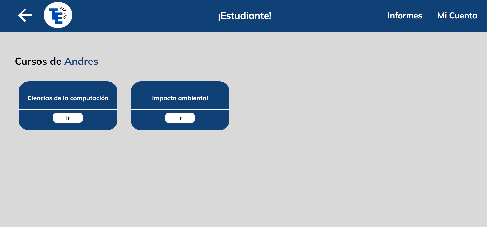
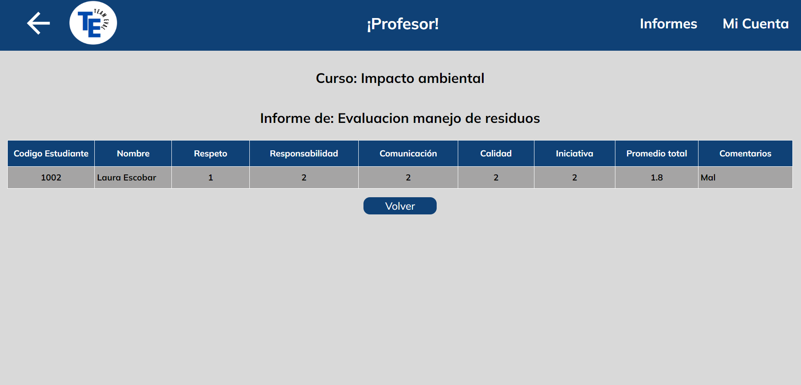

# TeamEval
Descripción: Desarrollo de una plataforma web que facilita la
evaluación por pares del desempeño individual dentro de los
equipos en contextos educativos. La aplicación permite a
profesores y estudiantes medir y mejorar la contribución
individual a los proyectos de grupo, proporcionando una
retroalimentación constructiva y detallada.
# Imagenes de la web
# Pagina inicio

# Formulario de inicio de sesión

# Cursos del estudiante

# Evaluación a compañeros de grupo

# Retroalimentación de la evaluación

# Perfil

# Pagina de inicio del profesor

# Retroalimentación de todo el curso

